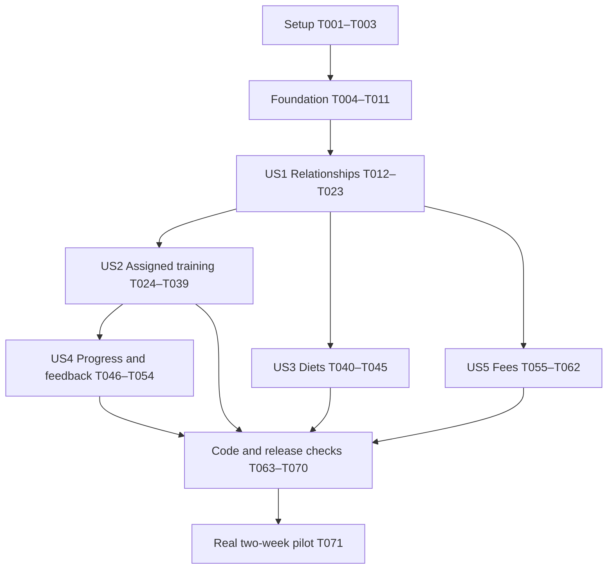

# Tasks: Trainer–Client Coaching MVP

**Input:** `specs/001-trainer-client-coaching/` documents: `spec.md`, `plan.md`, `research.md`, `data-model.md`, `contracts/http-api.md`, `contracts/ui-and-sync.md`, and `quickstart.md`.

**Scope:** Task generation only. All checkboxes begin unchecked; no application changes, deployment, or pilot activity are implied. Existing Git checkout is `main`; implementation prepares `codex/001-trainer-client-coaching` without discarding existing work. The prototype in `design/coaching-prototype/` is the accepted visual reference, not the application to replace or deploy.

**Tests:** Focused behavioral tests implement the specification's explicit Independent Test/Acceptance Scenarios and SC-006/SC-007 access, preservation, and checkout test requirements. Write the listed story tests before their implementation and observe relevant failures. Use existing Node test/Vitest runners; no blanket snapshot suite or new test framework. The constitution is an unfilled template and adds no inferred approval/TDD rules.

**Format:** `- [ ] Tnnn [P?] [USn?] Action with exact repository-relative file paths`. `[P]` identifies disjoint test-authoring work that can run together after its phase prerequisites. It does not bypass prerequisites or authorize automatic agent spawning. Unmarked tasks run sequentially unless the dependency section explicitly allows a separate branch of work. New file paths are intended implementation targets.

## Phase 1: Setup

**Purpose:** Prepare the existing application and isolated verification tooling, without replacing its stack.

- [X] T001 Prepare or reuse `codex/001-trainer-client-coaching`, preserve existing changes and the nested prototype repository, and record the starting commit plus baseline API/frontend test and build results in `specs/001-trainer-client-coaching/validation.md`; use the existing commands in `specs/001-trainer-client-coaching/quickstart.md` and distinguish preexisting failures.
- [X] T002 Add the researched pinned `better-sqlite3` 13.0.3 dependency to `api/package.json` and `api/package-lock.json` under Node 22; verify import/open/write/reopen locally and retain the existing HTTP, authentication, and optional AI dependencies.
- [X] T003 Extend the existing isolated-data conventions with `api/test/coaching-helpers.mjs` for temporary JSON/SQLite stores, existing signed-session test fixtures, controllable business time, and two trainers/two clients/one unlinked account; keep all authentication shortcuts inside tests and production data untouched.

## Phase 2: Foundational prerequisites

**Purpose:** Establish shared storage, authorization, and transport before any user story.

**Prerequisite:** T001–T003. T004 and T005 may be authored together; run their relevant assertions again as T006–T011 land.

- [X] T004 [P] Add migration/rollback/reopen tests in `api/test/coaching-storage.test.js`, asserting preserved legacy identities/state, foreign-key and uniqueness enforcement, failed-migration startup refusal, and no empty-database replacement on corruption.
- [X] T005 [P] Add common request-boundary tests in `api/test/coaching-access.test.js` for existing signed sessions, disabled accounts, Origin/JSON/500KB limits, 401/403/404 behavior, version conflicts, safe idempotency replay, no-store responses, and no private request-body logging.
- [X] T006 Implement startup configuration in `api/coaching/config.js` and document it in `.env.example`: independent `TRAINER_UIDS`, exact-host `COACHING_PAYMENT_HOSTS`, currency/exponent JSON `COACHING_CURRENCIES`, validation errors, and fee-only setup-unavailable behavior when payment configuration is absent.
- [X] T007 Implement `api/coaching/db.js` and `api/coaching/migrations/001_shared.sql` with schema versioning, one connection, foreign keys, WAL, FULL synchronization, 5,000ms busy timeout, and shared TrainerProfile/ClientRelationship/PlanTemplate/PlanAssignment/PlanRevision/SyncReceipt/MutationReceipt tables and indexes; validate account references against existing identity authority without migrating credentials or personal JSON.
- [X] T008 Implement prepared-statement transaction/version/idempotency helpers in `api/coaching/mutations.js` and schema/error normalization in `api/coaching/validation.js`; reject changed-payload ID reuse, store no plaintext invitation token in receipts, check replay authorization, and return retryable unsaved failures without awaiting external work inside transactions.
- [X] T009 Implement scoped capability/relationship guards in `api/coaching/access.js` and common handler registration in `api/coaching/routes.js`, integrating startup and existing session helpers in `api/server.js`; enforce Origin/content/body bounds, cursor/range limits, safe errors, and no-store behavior without exposing administrator routes to trainers.
- [X] T010 Implement the coaching client transport in `frontend/src/lib/coaching/api.js` and server-view state in `frontend/src/store/useCoachingStore.js`: mutation IDs/expected versions, truthful loading/save/error states, per-user own-cache boundaries, memory-only trainer data, revalidation on focus/navigation and every 30 seconds while visible, and cache clearing after denial/account change; keep `/api/` excluded in `frontend/public/sw.js`.
- [X] T011 Implement owner-scoped reusable-template CRUD and immutable copy/publication primitives in `api/coaching/templates.js` and `api/coaching/plans.js`, with kind-specific validation hooks, one current assignment per relationship/kind, source ownership checks, expected-version conflict handling, and no mutation of previously delivered copies; expose routes only when each story's validator/service is ready.

**Checkpoint:** Shared storage/request tests pass, migration failure stops startup, and no client-writable state can supply coaching authority. The foundation does not yet claim completed coaching workflows.

## Phase 3: User Story 1, invite and manage linked clients (P1)

**Goal:** Explicitly link a client, show real capability-based navigation/empty states, and let either party end sharing.

**Independent test:** Use new and existing passkey accounts to accept a seven-day invitation, preserve existing history, deny another trainer/client, and end from either party. The client retains their own records; the trainer loses access on the next request. Run quickstart A–C.

### Acceptance tests

- [X] T012 [P] [US1] Add invitation/profile/bootstrap/relationship contract tests in `api/test/coaching-invitations.test.js`, covering concurrent redemption, seven-day expiry, revoke/used/repeat tokens, one active trainer, self-invitation rejection, disabled trainers, invite-only one-account admission, interrupted registration/consent recovery, and ended/rejoined access.
- [X] T013 [P] [US1] Add join-intent/capability/cache behavior tests in `frontend/src/lib/coaching/join.test.js`, covering passkey-flow return, explicit consent, failed saves, successful-recipient revisit, no arbitrary role promotion, same-account recovery, and clearing displayed data after account change or revoked access.

### Implementation

- [X] T014 [US1] Implement trainer profile setup/edit and bootstrap capability summaries in `api/coaching/profiles.js`, `api/coaching/routes.js`, and `api/server.js`; add capabilities to `/api/me` without breaking its existing user shape, preserve independent admin status, snapshot valid business zones on relationships, and return only entitled modes/own archived relationship summaries.
- [X] T015 [US1] Add `api/coaching/migrations/002_invitations.sql` and implement hashed 32-byte-token issuance/preview/revoke/accept in `api/coaching/invitations.js`; bridge `api/server.js` registration options/verification through an atomic JSON SignupAdmission save followed by separate SQLite consent acceptance, enforcing one admitted account/token and safe replay without pretending JSON and SQLite share a transaction.
- [X] T016 [US1] Implement relationship ending in `api/coaching/relationships.js` with either-party authorization, consent/end metadata, immediate trainer read/write denial, owner-only archived access, and narrow safe ending receipts; expose an integration point for T029's schedule catch-up/cancellation without deleting received records or reactivating old relationships.
- [X] T017 [US1] Register profile/invitation/accept/revoke/end routes and initial paginated overview/workspace reads in `api/coaching/routes.js` and `api/coaching/workspaces.js`; rate-limit preview/registration using trusted client-IP derivation, return minimal trainer/consent previews, and supply truthful empty sections until later stories populate them.
- [X] T018 [US1] Implement `frontend/src/lib/coaching/join.js` and `frontend/src/views/coaching/Join.jsx`, integrating `frontend/src/views/Login.jsx`, `frontend/src/lib/api.js`, and `frontend/src/App.jsx` so `/#/join/:token` survives sign-in/new passkey registration, displays exact trainer/sharing consent, and links only after authenticated acceptance succeeds.
- [X] T019 [US1] Adapt the approved responsive appearance in `frontend/src/components/coaching/CoachingShell.jsx` and `frontend/src/components/coaching/coaching.css`, integrating `frontend/src/App.jsx` and `frontend/src/components/TabBar.jsx`; retain personal routes/preferences, real capability-based modes, keyboard focus, mobile navigation, and no prototype demo-state switch.
- [X] T020 [US1] Build initial `frontend/src/views/coaching/TrainerHome.jsx`, `frontend/src/views/coaching/ClientHome.jsx`, and `frontend/src/views/coaching/ClientWorkspace.jsx` with client search, relationship-aware empty states, personal-tool access, and workspace section slots; keep unlinked individual home and standalone mobile behavior intact.
- [X] T021 [US1] Add trainer identity/time-zone/contact settings in `frontend/src/views/coaching/TrainerSettings.jsx` and `frontend/src/views/Settings.jsx`, plus shared `frontend/src/components/coaching/ContactTrainer.jsx` for normalized user-initiated WhatsApp links, no private-data/message prefill, copy-number fallback, and unavailable-contact state; this shared control is needed by the diet empty state as well as US4.
- [X] T022 [US1] Add invitation copy/revoke/lost-link replacement and relationship end/archive controls in `frontend/src/views/coaching/Invitations.jsx` and `frontend/src/views/coaching/ClientWorkspace.jsx`, integrating the homes and coaching store; retain one-time link semantics, preserve personal history, and remove displayed trainer client data on denied refresh/replay.
- [ ] T023 [US1] Run T012–T013 and quickstart A–C, record actual passkey/consent/isolation/ending evidence in `specs/001-trainer-client-coaching/validation.md`, and correct failures in the US1 files before marking the relationship milestone complete.

**Checkpoint:** US1 works with no workouts, diets, check-ins, or fees. Later stories reuse its relationship and archive boundary, adding domain-specific retention assertions.

## Phase 4: User Story 2, assign plans and log workouts (P1)

**Goal:** Publish a client-specific weekly plan and use the existing logger with preserved targets and durable offline results.

**Independent test:** With one active relationship, assign a template, start online, log/finish offline, revise the plan, and replay a stale personal upload. Original targets/results survive once; upcoming unstarted targets update. Personal offline starts still work. Run quickstart D–F.

### Acceptance tests

- [X] T024 [P] [US2] Add workout-template/publication/occurrence API tests in `api/test/coaching-plans.test.js` for client-copy isolation, owner/client-write denial, expected versions, reps/time/cardio/custom exercise targets, stable moves across weeks, cancellation, 28-day materialization, downtime catch-up, business-zone boundaries, and frozen past/started occurrences.
- [X] T025 [P] [US2] Add session/result/history API tests in `api/test/coaching-sessions.test.js` for current online-start snapshots, lost-response retries, immutable full prescriptions including skipped exercises, zero/partial/extra attempts, terminal conflict handling, post-end owner upload, and canonical results surviving stale or forged `/api/data` entries.
- [X] T026 [P] [US2] Add offline and logger-adapter behavior tests in `frontend/src/lib/coaching/outbox.test.js` and `frontend/src/lib/coaching/logger.test.js` for enqueue-before-clear, quota failure, reload/crash, expiry, owner logout/login recovery, ID deduplication, target-versus-actual separation, and personal offline logging compatibility.

### Implementation

- [X] T027 [US2] Add WorkoutOccurrence/change-history/AssignedSession schema and constraints in `api/coaching/migrations/003_workouts.sql`, including stable recurrence identity, immutable snapshot/result fields, scheduled/locked/canceled state, materialized-through tracking, and deduplication indexes.
- [X] T028 [US2] Implement workout content validation and publication in `api/coaching/plans.js`, using shared template primitives and preserving ordered stable slots/entry IDs, exercise-name copies, units, applicable targets/rest/notes, and immutable client-specific revisions; enforce no authority from personal routines or automated suggestions.
- [X] T029 [US2] Implement occurrence generation/reconciliation/move/reset/cancel in `api/coaching/occurrences.js`, and integrate publication/relationship ending in `api/coaching/plans.js` and `api/coaching/relationships.js`; catch up elapsed dates before changes, extend through today plus 28 days, preserve date overrides across week moves, freeze past/started rows, and cancel only eligible upcoming rows on ending.
- [X] T030 [US2] Implement online start and finished/abandoned result ingestion in `api/coaching/sessions.js`: validate current occurrence/version and business date transactionally, freeze the complete server prescription, accept only owner actuals, compute completion summaries, preserve distinct attempts, and return identical retry acknowledgements without overwriting conflicting payloads.
- [X] T031 [US2] Wire workout template/publication/occurrence/session routes and workspace payloads in `api/coaching/routes.js` and `api/coaching/workspaces.js`, including owner session recovery after ending, trainer denial after ending, paginated session reads, and counts that never include fee status in authorization.
- [X] T032 [US2] Implement durable UID-scoped own-session storage and terminal-operation retry in `frontend/src/lib/coaching/outbox.js`, integrating `frontend/src/store/useCoachingStore.js` and `frontend/src/store/useStore.js`; preserve pending payloads across logout/expiry, pause on wrong-owner sessions/conflicts, and remove only matching acknowledged operations.
- [X] T033 [US2] Implement the assigned logger adapter in `frontend/src/lib/coaching/logger.js` and integrate `frontend/src/sheets.jsx` plus `frontend/src/views/Workout.jsx`; require successful online snapshot start, bypass progression for prescribed targets, keep actual deviations separate, preserve wholly skipped targets, enqueue before active clear, and retain timers/personal offline behavior.
- [X] T034 [US2] Build workout template and client-copy editing/publication UI in `frontend/src/views/coaching/WorkoutPlans.jsx` and `frontend/src/components/coaching/WorkoutPlanEditor.jsx`, supporting ordered exercises/modes/units/rest/notes, draft saves, explicit publication, stale-version recovery, and future occurrence move/cancel controls without changing another copy.
- [X] T035 [US2] Integrate today's assigned/rest/no-plan states and the weekly schedule in `frontend/src/views/coaching/ClientHome.jsx` and `frontend/src/views/coaching/ClientWorkspace.jsx`; provide a normal start path within two actions, business-zone labels, truthful partial/empty/extra outcomes, and visible saved-on-device/waiting/synced/error states.
- [X] T036 [US2] Implement canonical assigned-result projection in `api/coaching/history.js` and `api/server.js`, and reconciliation in `frontend/src/store/useStore.js`; prefer SQLite sessions over same-ID personal entries even when local `_ts` wins, expose server receipt times, reject personal-state authority injection, and retain existing personal-state conflict behavior.
- [X] T037 [US2] Preserve assigned identifiers/full snapshots through history/export/import handling in `frontend/src/views/History.jsx`, `frontend/src/views/Settings.jsx`, `frontend/src/sheets.jsx`, and `frontend/src/lib/import-csv.js`; label synchronized assigned results read-only while preserving personal edit/delete/import behavior and never granting authority from imported assignment-looking data.
- [X] T038 [US2] Integrate assigned-day reminder resolution in `api/server.js` through `api/coaching/occurrences.js`, preferring the eligible assigned occurrence without duplicate personal reminders, honoring existing opt-in/timing behavior, and preserving standalone mobile reminder behavior in `frontend/src/lib/mobile.js`.
- [ ] T039 [US2] Run T024–T026 and quickstart D–F, including account-switch/ended-relationship replay and legacy personal regression scenarios, and record results in `specs/001-trainer-client-coaching/validation.md`; fix preservation or count failures before accepting the training milestone.

**Checkpoint:** US1 + US2 form the first useful internal coaching demonstration. This is not the full specified product; diets, progress feedback, and fees remain required.

## Phase 5: User Story 3, publish and follow a simple diet (P2)

**Goal:** Reuse meal/portion/note templates and deliver independently editable client copies.

**Independent test:** With an active relationship and no workout assignment, publish and revise a diet; other copies remain unchanged, client edits deny, and viewing never reports adherence. Run quickstart G.

### Acceptance tests

- [X] T040 [P] [US3] Add diet-template/publication/read contract tests in `api/test/coaching-diets.test.js`, covering no-workout clients, copy isolation, current revision/date, template ownership, client-write denial, stale versions, and owner archive retention after ending.
- [X] T041 [P] [US3] Add diet draft/display behavior tests in `frontend/src/lib/coaching/diet.test.js`, covering meal ordering/portion text, explicit online publication, error/conflict preservation, empty/contact states, and no adherence mutation on view.

### Implementation

- [X] T042 [US3] Implement diet schema validation and template-to-client-copy publication in `api/coaching/diets.js` using the shared tables and primitives in `api/coaching/templates.js` and `api/coaching/plans.js`; retain immutable received revisions, one current diet, and trainer-only active-relationship writes without depending on workout records.
- [X] T043 [US3] Register diet-kind template/publication behavior and current/archived diet reads in `api/coaching/routes.js` and `api/coaching/workspaces.js`, with last publication time and no nutrition generation or view-derived adherence.
- [X] T044 [US3] Build diet authoring/draft helpers in `frontend/src/lib/coaching/diet.js`, `frontend/src/views/coaching/DietPlans.jsx`, and `frontend/src/components/coaching/DietPlanEditor.jsx`, plus read-only `frontend/src/views/coaching/MyDiet.jsx`; integrate home/workspace routes, explicit save/conflict states, and T021's contact fallback when no diet exists.
- [ ] T045 [US3] Run T040–T041 and quickstart G with two client copies and an ended relationship, recording copy isolation, update dates, no-workout operation, and no implied adherence in `specs/001-trainer-client-coaching/validation.md`.

**Checkpoint:** Diets work independently of workouts/check-ins/fees; shared plan foundations do not require a client workout assignment.

## Phase 6: User Story 4, progress and check-in feedback (P2)

**Goal:** Show trustworthy progress and one editable weekly feedback response, with WhatsApp for conversation.

**Independent test:** With linked-client example history, compare scheduled/completed counts, submit/edit a weekly report, respond/edit, and verify review state plus contact fallback. Missing and unsynced values are explicit. Run quickstart H–I.

### Acceptance tests

- [X] T046 [P] [US4] Add authorized progress/history contract tests in `api/test/coaching-progress.test.js` for stable weekly denominators, single-occurrence completion, extra sessions, strength/unit handling, weight-source labeling, true server receipt times, missing data, and exclusion of credentials/AI settings/other relationships' records.
- [X] T047 [P] [US4] Add check-in/response version and owner-boundary tests in `api/test/coaching-check-ins.test.js`, plus contact behavior tests in `frontend/src/lib/coaching/contact.test.js`; assert one client/week record, four adherence values, retained stale responses, concurrent edit conflicts, correct week boundaries, and user-only WhatsApp opening without private prefill.

### Implementation

- [X] T048 [US4] Add WeeklyCheckIn and CheckInResponse constraints in `api/coaching/migrations/004_check_ins.sql`, with relationship/week uniqueness, optional explicit-unit weight, response version, reviewed-check-in version, and retained timestamps; retain SyncReceipt from the shared migration.
- [X] T049 [US4] Implement check-in upsert and single-response logic in `api/coaching/check-ins.js`, validating Monday business weeks, allowed historical/current weeks, active-role writes, adherence/optional values, and expected versions; preserve prior response when the client updates and reject a response to an unseen newer report.
- [X] T050 [US4] Implement minimal history/progress derivation in `api/coaching/progress.js` using `api/coaching/history.js`, updating personal/assigned receipt persistence in `api/server.js` and `api/coaching/sessions.js`; reuse equivalent existing strength calculations without changing their semantics, label missing/legacy timestamps and weight sources, and never expose entire personal state.
- [X] T051 [US4] Wire progress/history/check-in/response interfaces and overview/workspace summaries in `api/coaching/routes.js` and `api/coaching/workspaces.js`; include missing/unreviewed weeks, last activity, distinct sync times, stable completed/scheduled/extra counts, and owner-only archive behavior.
- [X] T052 [US4] Build `frontend/src/views/coaching/WeeklyCheckIn.jsx` and `frontend/src/components/coaching/CheckInResponse.jsx` with four adherence options, optional weight/notes, one editable trainer response, visible previous-response timestamp, explicit online save, and stale-version/needs-review handling.
- [X] T053 [US4] Build `frontend/src/views/coaching/Progress.jsx` and integrate `frontend/src/views/coaching/TrainerHome.jsx`, `frontend/src/views/coaching/ClientHome.jsx`, and `frontend/src/views/coaching/ClientWorkspace.jsx` with week selection, strength/weight views, completion/extra classifications, missing/sync labels, and T021's contact action; keep fee summaries empty until US5 provides them.
- [ ] T054 [US4] Run T046–T047 and quickstart H–I feedback/contact scenarios, including no diet, missing data, timezone/DST boundaries, and >28-day downtime, recording counts, review-state resets, and private-data-safe contact behavior in `specs/001-trainer-client-coaching/validation.md`.

**Checkpoint:** Complete progress depends on US2's occurrence/session authority, but check-ins require neither a diet assignment nor fees. No conversation thread has been introduced.

## Phase 7: User Story 5, fees and verified receipt (P2)

**Goal:** Publish external payment links and record trainer-confirmed receipt with retained corrections.

**Independent test:** With a linked client but no workout/diet/check-in records, create a fee, open/cancel/return from checkout, confirm as trainer, and correct with a reason. Checkout never marks paid; clients/unrelated users cannot mutate receipts. Run quickstart J.

### Acceptance tests

- [X] T055 [P] [US5] Add fee CRUD/state/audit contract tests in `api/test/coaching-fees.test.js` for positive minor-unit amounts, configured currencies/hosts, date boundaries, trainer-only confirmation, identical/conflicting retries, transactional rollback, reasoned reversal/void, complete event history, and ended-owner reads with trainer denial.
- [X] T056 [P] [US5] Add fee/browser-action behavior tests in `frontend/src/lib/coaching/fees.test.js`, proving checkout-open/cancel/success-looking return leaves unpaid, no client confirmation exists, archived actions disable, copy/contact fallback remains available, and overdue status never gates logger/history access.

### Implementation

- [X] T057 [US5] Add Fee/FeeEvent schema and indexes in `api/coaching/migrations/005_fees.sql`, storing fixed amount/currency/exponent/period/due/zone/link details, status/version, immutable authors/times/reasons, and mutation uniqueness.
- [X] T058 [US5] Implement creation, externally verified confirmation, reasoned paid-to-unpaid correction, and unpaid voiding in `api/coaching/fees.js`; atomically save status/events/idempotency, validate safe configured URLs without server fetches, derive overdue after business due-day end, and keep partial payments/refunds/automated collection out of scope.
- [X] T059 [US5] Register fee list/create/confirm/correct/void routes and currency-grouped home summaries in `api/coaching/routes.js` and `api/coaching/workspaces.js`; enforce active linked-trainer mutations, own archived reads, no archived checkout action, and no checkout-success endpoint or payment-based workout restriction.
- [X] T060 [US5] Implement `frontend/src/lib/coaching/fees.js` and `frontend/src/views/coaching/Fees.jsx` for validated creation, hostname-visible external checkout with opener/referrer isolation, manual receipt/date confirmation, reasoned corrections/void, retained audit display, and truthful pending/error/setup-unavailable states.
- [X] T061 [US5] Integrate outstanding/overdue fees and trainer review actions into `frontend/src/views/coaching/TrainerHome.jsx`, `frontend/src/views/coaching/ClientHome.jsx`, and `frontend/src/views/coaching/ClientWorkspace.jsx`; refresh on checkout return without inferring payment, group totals by currency, and keep retry/contact and training accessible.
- [ ] T062 [US5] Run T055–T056 and quickstart J, including concurrent confirmation/correction and fee-only client fixtures, and record unpaid-checkout invariance, role denial, audit retention, and uninterrupted training access in `specs/001-trainer-client-coaching/validation.md`.

**Checkpoint:** All five specified stories are implemented and individually validated. Full-product release checks remain below.

## Phase 8: Polish and cross-cutting validation

**Prerequisite:** All story checkpoints. Operational pilot measurement is explicitly separate from code readiness; do not check it off using simulated participants or deploy without applicable authorization.

- [X] T063 Extend `api/test/coaching-access.test.js` and add `frontend/src/lib/coaching/privacy.test.js` to verify every implemented resource/replayed mutation against unrelated, ended, disabled, and switched accounts, including archived diet/fee/check-in retention, cleared trainer caches, unsynced owner queues, no API service-worker caching, and no sensitive request logs.
- [X] T064 Update `api/Dockerfile` to include new coaching modules/migrations and any actually required native build support; preserve existing optional-runtime isolation and `docker-compose.yml` topology/local persistent volume, then build API/web images and prove SQLite insert/read/reopen/migration startup on the deployment architecture, recording evidence in `specs/001-trainer-client-coaching/validation.md`.
- [X] T065 Document trainer provisioning, configured payment/currency setup, one-process/local-disk limits, before-migration and daily whole-data backup procedure, restore/fix-forward boundaries, existing license/source/media obligations, and actual start commands in `docs/SELF_HOSTING.md` and `specs/001-trainer-client-coaching/quickstart.md`; retain the distinction between new features and the separately hosted prototype.
- [X] T066 Complete quickstart K on isolated legacy-data copies, extending `api/test/coaching-storage.test.js` where reproducible fault injection is useful; exercise migration failure, interrupted transactions, full stopped-API backup/restore, preserved sign-in/history/snapshots/fee events, and pending-result replay, recording actual evidence in `specs/001-trainer-client-coaching/validation.md`.
- [X] T067 Validate quickstart I on 320px/390px/tablet/desktop and physical iPhone Safari/Android Chrome over the test HTTPS origin; fix overflow, keyboard/focus/dialog and readable save-state issues in `frontend/src/components/coaching/coaching.css` and `frontend/src/components/coaching/CoachingShell.jsx`, and record device/browser evidence or explicitly pending physical checks in `specs/001-trainer-client-coaching/validation.md` without treating viewport emulation as a physical-device pass.
- [ ] T068 Measure quickstart L with ten-client representative histories using a repeatable isolated fixture/measurement script in `api/test/coaching-performance.mjs`; verify ordinary p95 API <=500ms and mobile workspace <=2 seconds on the intended environment, record excluded external/intentional-contention timings separately, and document any necessary measured-query/index changes in `specs/001-trainer-client-coaching/validation.md`.
- [ ] T069 Run complete API/frontend tests, production frontend build, and quickstart A–L regression checks; verify no personal-mode/standalone-mobile regression, refresh the knowledge graph with the repository's prescribed update workflow, and record commands/results plus any unresolved release checks in `specs/001-trainer-client-coaching/validation.md` and generated `graphify-out/graph.json`.
- [X] T070 Prepare the proposed one-trainer/5–10-client pilot checklist and SC-001–SC-008 measurement sheet in `specs/001-trainer-client-coaching/pilot.md`, capturing actual provider/country/currency/contact configuration, successful restore and device-check prerequisites, task timings/assistance counts, participant consent, and exact two-week success thresholds; label operational inputs that are not yet supplied instead of inventing them.
- [ ] T071 After the owner launches the pilot and participants are available, collect actual SC-001–SC-008 outcomes across two weeks in `specs/001-trainer-client-coaching/pilot.md`; report missed thresholds and follow-up work, and leave this operational task unchecked until real evidence exists rather than claiming implementation tests establish pilot success.

## Phase 9: Convergence

**Purpose:** Close the trainer plan-authoring, client Personal-journey, and schedule-recovery gaps found during the `sachin_trainer -> test_1` hands-on walkthrough.

- [X] T072 [P] [US2] Add reconciliation/operation contract tests in `api/test/coaching-plans.test.js` for removed/added weekdays, plan-removed versus explicit cancellation, cancel/restore with stable ID, move/reset/no-op, far-future and duplicate-weekday collisions, immutable past/started rows, on-read/start catch-up, relationship-zone boundaries, and correct progress denominators per FR-007 and US2/AC10 (contradicts).
- [X] T073 [US2] Add `api/coaching/migrations/006_occurrence_restore.sql` and refactor `api/coaching/occurrences.js`, `api/coaching/plans.js`, `api/coaching/workspaces.js`, `api/coaching/sessions.js`, and `api/coaching/routes.js` to reconcile the desired future schedule, audit plan removal/restoration, expose idempotent trainer Restore plus Reset, preserve valid overrides/frozen rows, reject collisions/duplicate weekday ownership, and catch up before reads/starts per FR-007 and US2/AC10 (contradicts).
- [X] T074 [P] [US2] Add frontend/API tests for separate plan-entry/catalog identity, legacy normalization, reps/time/cardio/custom metadata, personal/PPL conversion including Sunday, template/source isolation, source ownership, and assignment unit/rest/notes per FR-005–FR-006 and US2/AC7–AC8 (partial).
- [X] T075 [US2] Extend workout validation and trainer-scoped reads in `api/coaching/plans.js`, `api/coaching/templates.js`, `api/coaching/workspaces.js`, and `api/coaching/routes.js` with legacy-compatible `entryId`/`exerciseId`, bounded custom metadata, `sourceTemplateId` publication, and a bounded recent-assignment plan-source endpoint that exposes no client results/history per FR-005–FR-006 (missing).
- [X] T076 [US2] Extract the existing searchable/filterable animated exercise selector from `frontend/src/sheets.jsx` into a reusable component and add pure converters for trainer personal routines and Starter PPL under `frontend/src/lib/coaching/`, preserving catalog/custom identity, mode defaults, units, rest, notes, and lazy media per FR-005–FR-006 and US2/AC7–AC8 (contradicts).
- [X] T077 [US2] Rework `frontend/src/components/coaching/WorkoutPlanEditor.jsx` and `frontend/src/views/coaching/WorkoutPlans.jsx` into a catalog-backed composer with Blank, saved template, My personal plan, Starter PPL, and recent-assignment sources; support save-as/update/archive, dirty-draft protection, selected `sourceTemplateId`, and explicit publication/conflict states per FR-005 and US2/AC7–AC8 (missing).
- [X] T078 [US2] Build an always-visible grouped schedule manager in `frontend/src/views/coaching/WorkoutPlans.jsx` and improve `frontend/src/views/coaching/ClientWorkspace.jsx` to show relevant Upcoming/Canceled/Past rows with row-scoped Move, Reset, confirmed Cancel, Restore, conflict recovery, business-zone labels, and no draft replacement during refresh per FR-007 and US2/AC10 (partial).
- [X] T079 [P] [US2] Add pure own-assignment schedule selectors and Zustand refresh tests in `frontend/src/lib/coaching/schedule.test.js` and coaching-store tests for bootstrap+workspace mount/focus/30-second refresh, moved/canceled filtering, assigned/personal collisions, stale cache/access clearing, and device-versus-relationship dates per FR-006 and US2/AC9 (partial).
- [X] T080 [US2] Implement one `refreshOwnCoaching()` flow in `frontend/src/store/useCoachingStore.js` and project the read-only coach assignment into `frontend/src/views/Home.jsx`, `frontend/src/views/Plan.jsx`, `frontend/src/views/Workout.jsx`, and `frontend/src/components/TabBar.jsx`; prioritize today's assignment and keep assigned start online-only per FR-006 and US2/AC9 (missing).
- [X] T081 [US2] Complete assigned logger presentation and resilience in `frontend/src/lib/coaching/logger.js`, `frontend/src/sheets.jsx`, `frontend/src/views/Workout.jsx`, and personal history rows so catalog animations, prescription notes, per-exercise rest, assignment unit, Coach-assigned status, waiting/synced state, and start/version/network errors are accurate without applying personal progression per FR-006–FR-007 (partial).
- [ ] T082 [US2] Run all API/frontend tests and production build, rebuild Docker web/api, execute quickstart M–O plus Safari trainer/Firefox client publish→Personal→start→finish/sync→revise→move/reset/cancel/restore, record reproducible evidence in `specs/001-trainer-client-coaching/validation.md`, and update `graphify-out/graph.json` per FR-005–FR-007 (partial).
- [X] T083 [US2] Make an active coach plan exclusive across Personal Home/Plan/Start, direct personal and AI plan-editor routes, calendar overrides, and Settings plan actions; render the full read-only coach plan/schedule and lock assigned exercise/set structure while preserving actual logging and hidden personal data per revised FR-006 and US2/AC9.
- [X] T084 [US2] Recover server-started assigned sessions when local active state is missing; make Personal Home week/day selection project the selected occurrence; expose explicit cancellations in the read-only client schedule; and verify assignment, resume, completion, cancellation, move/reset/restore, and exclusive coached-mode behavior end to end per US2/AC9–AC11.

## Phase 10: Trainer schedule usability

**Purpose:** Make ordinary day-to-day schedule changes fast without changing the recurring plan or reusable source.

- [X] T085 [P] [US2] Add API and frontend regression coverage for future unstarted one-day prescription overrides, reset-to-current-recurring-plan, persistence across recurrence publication/day-off/restore, frozen started/completed rows, and simplified Manage actions in `api/test/coaching-plans.test.js` and `e2e/03-workouts.mjs`.
- [X] T086 [US2] Add the additive occurrence-override migration and trainer-only idempotent mutation in `api/coaching/migrations/007_occurrence_overrides.sql`, `api/coaching/occurrences.js`, `api/coaching/routes.js`, `api/coaching/sessions.js`, and `api/coaching/workspaces.js`; expose the effective prescription while retaining the current recurring prescription for reset.
- [X] T087 [US2] Reorder and simplify `frontend/src/views/coaching/WorkoutPlans.jsx` around Current plan, Upcoming schedule, and a single Manage control with Edit this workout, Reschedule, Give day off, Restore, and Return to plan; adapt `WorkoutPlanEditor.jsx` for a single-day editor and show consistent Day off/Customized/Rescheduled states on client views.

## Phase 11: Recurring source replacement

**Purpose:** Make publishing a different recurring plan replace the client's mutable future schedule rather than collide with and roll back to the previous plan.

- [X] T089 [US2] Reconcile fresh source day identities by stable original business date in `api/coaching/occurrences.js`, retire obsolete active rows before inserts, preserve locked history and relevant date/one-day overrides, and avoid no-op version increments on explicit days off.
- [X] T090 [US2] Hide internal `plan_removed` rows from operational Days off and date projections in `frontend/src/lib/coaching/schedule.js` and `frontend/src/views/coaching/WorkoutPlans.jsx`; give the built-in source the explicit `Starter PPL` name.
- [X] T091 [P] [US2] Add API and selector regressions for fresh-day-ID replacement, locked history, override retention, obsolete day-off retirement, and repeated-read version stability.
- [X] T092 [US2] Extend the two-browser workout journey to publish Starter PPL over an existing plan and prove the trainer and client receive only the replacement future schedule.
- [X] T088 [US2] Run focused and complete API/frontend suites, production build, fresh trainer/client E2E, update validation evidence and the knowledge graph, then place the verified build into the running localhost application without modifying real trainer/client records.

## Dependencies and execution order

### Phase and story graph

Default execution is numeric order. All stories require completed foundation and US1 relationship access. US3 and US5 require no workout data and may be developed after US1 using the shared foundation, even though the default priority order lists US2 first. Complete US4 requires US2 authority; it has no dependency on US3 or US5. US3 uses the contact component introduced in T021, avoiding a hidden US4 prerequisite.

US1's overview/workspace initially returns empty domain sections. US2/US3/US4/US5 populate their own sections; empty or unbuilt domain data must never be displayed as successful adherence or paid fees. Archive access is enforced in US1 and retested when each domain exists.

### Within phases

- Setup precedes foundation; T004/T005 test authoring is independent after setup. T006–T011 execute in order, and applicable foundation assertions must pass before story work.
- At each story entry, its marked test-authoring tasks can run together after story prerequisites. Tests may initially fail because handlers/modules are unimplemented; this is not permission to fake passing behavior.
- Within US2, schema T027 precedes publication/occurrence/session services T028–T030, route wiring T031, persistence/logger/UI T032–T035, reconciliation/history/reminders T036–T038, then checkpoint T039.
- The other stories follow schema/service, route, UI/integration, acceptance-check order as numbered. Every checkpoint uses that story's independent fixtures and preserves prior passed stories.
- Shared edits to `api/server.js`, `api/coaching/routes.js`, `api/coaching/workspaces.js`, `api/coaching/plans.js`, frontend homes, the coaching store, and `validation.md` must be serialized. Do not assume separate stories can concurrently edit these files safely.
- T063–T069 establish integration/release evidence; T070 prepares pilot execution. T071 requires real participants and elapsed time, not another implementation test run. Missing physical-device/operational inputs remain visibly pending; no automatic deployment, messaging, or scheduler setup is authorized by this task list.

### Parallel execution examples per story

These examples describe possible work allocation, not instructions to spawn agents now. Each pair/group uses distinct test files after its named prerequisites; integrate changes and run suites before proceeding to that story's implementation checkpoint.

- **US1, after T011:** T012 invitation/API acceptance tests alongside T013 join/capability frontend tests.
- **US2, after T023:** T024 plan/occurrence tests alongside T025 session API tests and T026 outbox/logger tests.
- **US3, after T023 and foundation:** T040 diet API tests alongside T041 frontend diet behavior tests.
- **US4, after T039:** T046 progress API tests alongside T047 check-in/contact tests.
- **US5, after T023 and foundation:** T055 fee API/audit tests alongside T056 checkout/UI behavior tests.

There are 13 `[P]` tasks across six disjoint test-authoring groups, including the foundation pair. Additional story-level work is logically independent as shown above, but shared-file integration remains sequential.

## Requirement and acceptance coverage

- FR-001: T014, T019–T020 establish capability homes; T035, T051–T053, T059–T061 supply assigned training/progress/fee summaries.
- FR-002–FR-004: T012–T023 cover consent, invitations, role boundaries, ending, and owned archives; T031/T040/T047/T055/T063 exercise domain retention and revoked access.
- FR-005–FR-007: T024–T039 cover independent copies, logger reuse, immutable targets/results, stable scheduling, progression isolation, and stale sync.
- FR-008: T040–T045 cover diet assignment/revisions and contact empty state via T021.
- FR-009–FR-012: T046–T054 cover progress, one weekly report/response, explicit adherence, sync/missing labels, and T021 contact behavior.
- FR-013–FR-015: T055–T062 cover fee publication, checkout invariance, manual receipt/corrections/audit, overdue/failure, and nonblocking training.
- FR-016: T001/T004/T010/T013/T018/T023/T026/T032–T039/T063/T066/T069 cover existing data/personal tools, offline persistence, account boundaries, and honest save states.
- SC-006 and SC-007 correctness requirements are enforced before pilot by the story suites and T063/T066/T069. T070 records the exact SC-001–SC-008 measurement protocol from `quickstart.md`; T071 supplies real user evidence, including two-week SC-008 outcomes.

## Implementation strategy

### First useful milestone

Complete setup, foundation, US1, and US2, then validate the full invite → assign → start → offline finish → trainer review-of-results loop. US1 alone is a useful access/consent checkpoint, but invitations without assigned logging are not the user's core product. Keep this initial milestone internal until applicable release checks pass.

### Full MVP

Add US3 diets, US4 progress/check-ins/contact, and US5 fees, validating each independently. Complete cross-cutting security, preservation, responsive/device, packaging, and restore checks. All five stories remain required for the specified coaching MVP; the milestone does not silently drop the commercial or feedback flow.

### Pilot and completion reporting

Maintain `validation.md` as implementation evidence and `pilot.md` as real participant evidence. Report code readiness separately from pending physical checks or the real two-week pilot. Do not check off an entire task when only its automated portion passed. No full chat, automatic billing, new AI, framework migration, or production rollout is added by task generation.

## Task totals and generation validation

- Setup: 3; foundation: 8; cross-cutting/pilot: 9.
- US1: 12; US2: 16; US3: 6; US4: 9; US5: 8.
- Total: 71 tasks. Parallel markers: 13.
- All task rows use unchecked checkbox, sequential ID, correct story label where required, and explicit file paths. Task generation does not mean these implementation/acceptance tasks have been executed.
